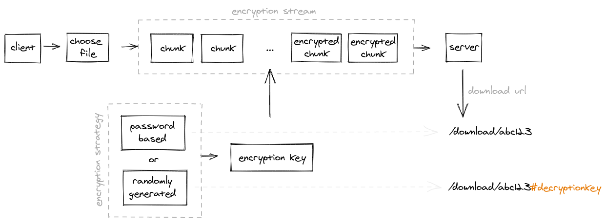

## Bytes And Pipes

[Bytes And Pipes](https://bytesandpipes.com) is an open-source web application to share large files easily and privately using only your internet browser. You can upload any type of file and a download link will be provided to you. Share this link with whoever you want with the assurance that no one but you can see its contents.

You can upload files of up to 1GB. Files will be deleted once they are downloaded, but you can upload the same file multiple times and share each link individually.

The inspiration for this project comes from Mozilla's Firefox Send (now discontinued).

## Encryption strategy

You can choose to encrypt your files in one of two ways:

- Password-based: provide a password to derive an encryption key. The other party will need to know the secret (your password) in order to obtain the corresponding decryption key. Use this method if you need to share the download link over public communication channels such as chatrooms and online forums.

- Randomly generated: an encryption key will be created for you automatically. The resulting download link will include the key so there is no need to remember any secret passwords. Use this method if you want a little more convenience and you plan to share the download link over secure channels.



## Upload Stream

While modern computers have powerful hardware there is still a limit of what they can do, and this limit becomes more obvious the larger the file we're trying to encrypt. For this reason files need to be split into smaller chunks of data in order to encrypt them efficiently.

Everything starts with the File API that reads the selected file. It's then converted into the byte representation and sliced down to the desired size (1MB by default). Each chunk is piped into an encryption function that is finally dispatched over the network to the server.

Because streaming requests using the Fetch API is still not possible I built my own encryption stream using asynchronous generators (`/client/src/scripts/encryptionStream.js`):

```js
const pipe = (...fns) => data => fns.reduce((val, fn) => fn(val), data);
pipe(reader, encrypter, uploader)(file);
```

## Download Stream

Coming soon

## Credits

https://github.com/mozilla/send

https://www.youtube.com/watch?v=3Tr-scf7trE

https://blog.excalidraw.com/end-to-end-encryption/

https://www.youtube.com/watch?v=SdePc87Ffik

https://www.youtube.com/channel/UCO1cgjhGzsSYb1rsB4bFe4Q

https://www.youtube.com/channel/UCW5YeuERMmlnqo4oq8vwUpg
